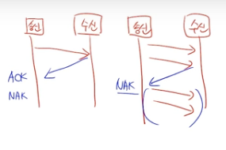

# 응용 SW 기초 기술 활용

### 운영체제의 특징

* 프로세스(Process) : CPU에 의해 처리되는 사용자 프로그램, 시스템 프로그램, 실행 중인 프로그램으로 작업(Job) 또는 태스크(Task)라고도 한다.
* 쓰레드(Thread) : 독립적으로 수행되는 순차적인 제어의 흐름이며 프로세스(에)서 실행 제어만 분리한 실행 단위이다.&#x20;

<figure><figcaption></figcaption></figure>

ARQ (자동반복 요청 방식)

* Stop-and-Wait ARQ 방식은 한 개의 프레임을 전송하고, 수신 측으로부터 ACK 및 NAK 신호를 수신할 때까지 정보 전송을 중지하고 기다리는 방식
* Go-back-N ARQ 방식은 데이터 프레임을 연속적으로 전송하는 과정에서 NAK를 수신하게 되면, 오류가 발생한 프레임 이후에 전송된 모든 데이터 프레임을 재전송하는 방식

<figure><figcaption></figcaption></figure>

